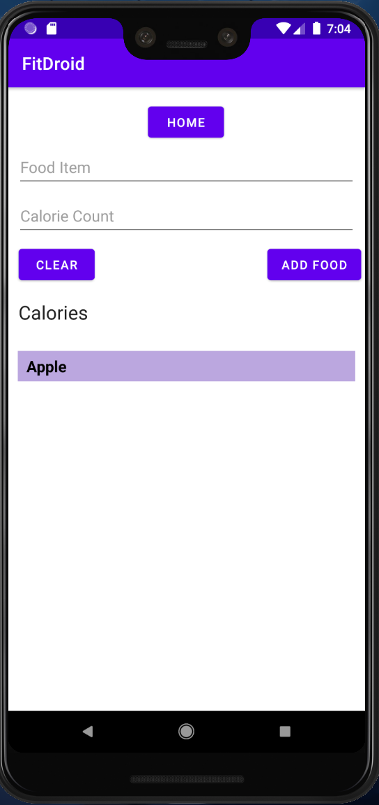
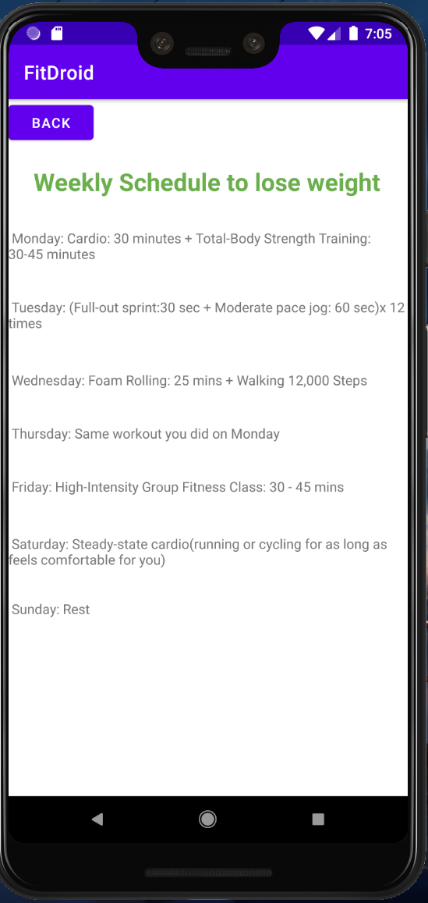
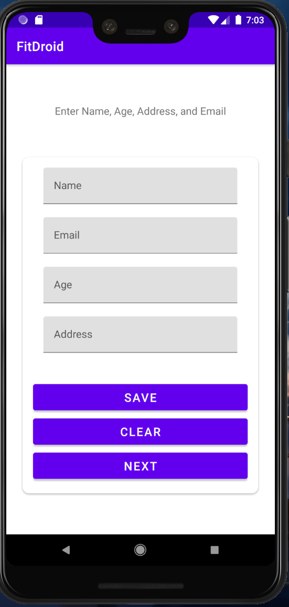
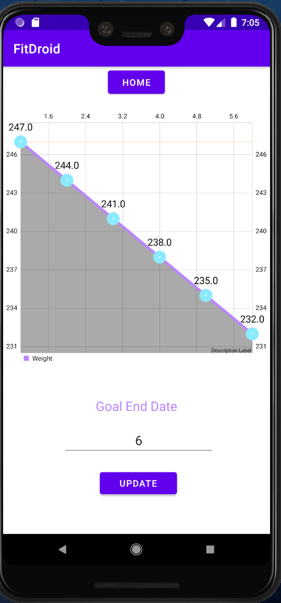

# FitDroid

Authors:
1. Kenny Tran (ktrancollege2000@csu.fullerton.edu)
2. David Bonnaud (dbonnaud@csu.fullerton.edu)
3. Andy Cao (dongyicao123@csu.fullerton.edu)
4. Triet Le (tle877@csu.fullerton.edu)

## Overview
### Summary
FitDroid aims to be an all in one platform for fitness and reaching personal weight goals. Rather than having different applications to track all this correlated information, this app allows users to have one centralized place to do it. Functionality includes calorie tracking, recommended workouts, and weight tracking.

### Platforms
Android 4.0+

## Background and motivation
Many people are experiencing rising stress/anxiety levels in their daily lives that lead to a lot of serious health problems. Thus, we wanted to create an application that allows people to monitor their health in a clear and efficient manner. It would really help alleviate the stress involved with personal health if all the things the person would need to reach their fitness or personal weight goals were available in one place.

## Features
1. Calorie Tracker (Kenny Tran) - This feature will allow users to track their calories per day by logging their data every time they eat or drink. The tracker will add up the total of calories and provide a list representing all things they’ve ingested 

2. Recommended Weekly Workout Schedule (Triet Le)> - This feature will allow users to input their height + weight and their body type desired. The app will use that information to decide the suitable exercises for each day. It may include the type of exercise, duration, image to illustrate... 

3. Basic Information (Andy Cao) - This feature will ask the user for basic information at the beginning of the app. For example, weight goal, activity level, sex, birth, and body weight. 
Profile Page(Andy Cao) - Create a profile page for users to change the information. 
Time-tracker - 60 seconds time limit

  |  

4. Weight Goals and Analytics (David Bonnaud) - Create a page that visualizes weight loss progress and track through weekly weight check-ins as well as provide information to help reach goals better.

